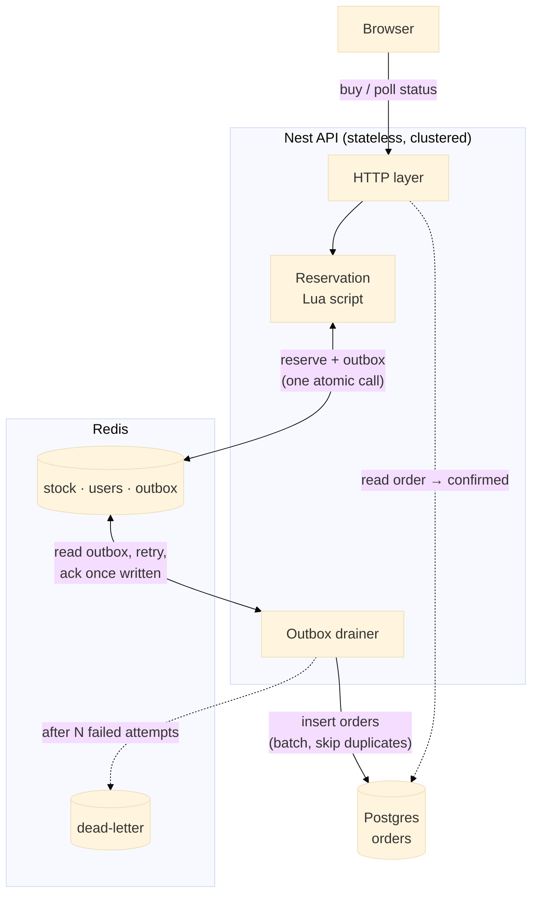

# Flash Sale

See [CONTEXT.md](./CONTEXT.md) for domain vocabulary and [docs/adr](./docs/adr) for architectural decisions.

## Layout

This is a Yarn workspaces monorepo:

- `/server` — Nest.js API (TypeScript), Prisma against Postgres.
- `/frontend` — React app (TypeScript), Vite.
- `docker-compose.yml` — Redis and Postgres only. The server and frontend are **not** dockerized; they run locally against this infra.

## Running the app

1. Install dependencies once, from the repo root:

   ```sh
   yarn
   ```

2. Build the shared `common` package and generate the Prisma client. Both are gitignored build outputs, so this is needed before `common` will resolve or the server will typecheck/run:

   ```sh
   yarn generate
   ```

3. Run the app. This starts the Docker infra (Postgres and Redis) and the API and frontend together:

   ```sh
   yarn dev
   ```

   Or run just one, from the repo root: `yarn workspace server run dev` / `yarn workspace frontend run dev`.

4. Apply database migrations (first time, and whenever the schema changes):

   ```sh
   yarn migrate:db
   ```

5. Copy env file:

   ```sh
   cp server/.env.example server/.env
   ```

## User flow

With the app running (`yarn dev`), a typical walkthrough:

1. Go to `/admin` and log in with the admin key (`change-me` by default, from `server/.env.example`'s `ADMIN_KEY`).
2. Fill up and create a sale using the admin sale form.
3. Go back to `/` (the "Sale" nav link) and enter a user name.
4. Attempt a purchase. The button reserves the item ("Item reserved ✓ / Confirming your order…") and flips to "Order confirmed" once the Order row lands in Postgres.

## Running tests

There are five kinds of server tests, from fastest/narrowest to slowest/broadest:

- **Unit** (`*.spec.ts`) — no external infra required.
- **Integration** (`*.integration.spec.ts`) — hit real Redis/Postgres directly (no HTTP layer). Requires `yarn dev`'s Docker infra running against your normal dev `DATABASE_URL`/`REDIS_URL`.
- **E2E** (`*.e2e-spec.ts`) — spin up the Nest app in-process and exercise it over HTTP with supertest.
- **Performance** (`*.performance-spec.ts`) — load-test the real app with `autocannon` against a clustered server and real Redis/Postgres, under both a short spike of many connections and a longer stress run with fewer.
- **Fault tolerance** (`*.fault-spec.ts`) — boot the real app, break its infra (Postgres, Redis, the app itself) out from under it via the Docker CLI, and check it recovers with no lost or duplicated orders. Requires `docker` on your PATH; the suites run one file at a time since they take down the shared containers.

E2E, performance and fault-tolerance tests run against an isolated database/Redis logical DB (see `server/.env.e2e`) rather than your dev environment, so they never read or clobber dev data. That database only exists if you're on a fresh Postgres volume (created by `docker/postgres-init/01-create-e2e-db.sql`) or you migrate it yourself:

```sh
yarn workspace server run migrate:e2e-db
```

Then, from the repo root:

```sh
yarn test:unit         # unit tests

# Everything below needs the yarn dev's infra (DB and Redis) running
yarn test:integration  # integration tests
yarn test:e2e          # e2e tests (needs the e2e db migrated, see above)
yarn test:performance  # performance tests (same isolated db/redis as e2e)
yarn test:fault-tolerance  # fault-tolerance tests (same isolated db/redis; stops/partitions the Docker containers)
```

Performance tests default to a 4-worker clustered server and can be tuned via env vars under `.env.e2e.` see the `test/support/config.ts` file for more details.

## Design choices and trade-offs

### System diagram

**Redis decides, Postgres remembers, and only Postgres confirms.** The Reservation (stock decrement + one-per-user check + an outbox entry saying "persist this") is one atomic Lua script in Redis, answered synchronously as "reserved". The durable Order row is written to Postgres afterwards by a drainer that reads that outbox and retries until it lands; the buyer is told "confirmed" only once that row exists.



The hot path (`POST /purchase` → reserve) touches only Redis, and it is a single Redis call: the same Lua script that decrements stock and marks the user also appends to the order outbox stream, so a Reservation can never exist without a record that its Order still needs persisting. The order write is async and idempotent (insert that skips duplicates on `UNIQUE (sale_id, user_id)`), so retries and re-deliveries are harmless. The confirmation read (`GET /purchase/:saleId`) goes the other way round: it answers `confirmed` from the Postgres Order row, and falls back to Redis only to report `reserved` while that row is still in flight.

### Key decisions

- **Redis decides who gets an item, Postgres keeps the record.** Doing this in Postgres alone would make every buyer wait in line on a single row, which caps how fast the sale can go. Redis answers in memory in one step, and Postgres only has to write one row per buyer afterwards, with no contention.

  - _Trade-off:_ for a few seconds Redis is the only place a purchase exists. If Redis restarts it loses at most one second of data because of every-second persisting, and on startup the app rebuilds Redis from Postgres if anything is missing.

  - _Trade-off:_ consistency over availability. If Redis is unreachable the sale stops (`/purchase` and `/sale/status` return 5xx) rather than guessing, so nobody is oversold or double-charged, whereas Postgres can be down for minutes and the sale keeps running.

- **Reserving an item and recording its order are one Redis write (transactional outbox).** The same Lua call that takes the stock also appends the order to a Redis stream, so a crash can never leave a reservation with no order behind it. Each API worker drains that stream straight into Postgres — one batched insert per pass that skips rows already there — and only acknowledges an entry once its row is written; if a worker dies mid-way, another worker picks up its entries after `ORDER_OUTBOX_CLAIM_IDLE_MS` (default 30s). The stream is the only queue on the persist path: its consumer group is what gives at-least-once delivery, crash recovery and (via the delivery counter) the attempt count.

  - _Trade-off:_ one more moving part on the write path (a stream, a consumer group, and an extra Redis connection per worker), and an entry left by a crashed worker waits out that idle timer before it is written.

- **The Postgres write is off the request path.** A buyer never waits on Postgres: a slow or unavailable database delays confirmations instead of blocking sales. The drainer retries until the write lands, backing off between passes (1s doubling to a cap, with jitter). A batch that fails is retried entry by entry in the same pass, so one entry that can never be written doesn't hold up the rest.

  - _Trade-off:_ once the item is reserved, that decision is final. If the Postgres write fails, the drainer keeps retrying rather than reversing the purchase, so the buyer can sit on "reserved, confirming your order…" for seconds or minutes while Postgres is unavailable. The hold is never released; the page says so after 15 s and keeps polling.

  - _Trade-off:_ retry backoff is per drainer pass rather than per order, and it is capped at half `ORDER_OUTBOX_CLAIM_IDLE_MS` so a drainer waiting out a backoff is never mistaken for a dead one.

- **Dead-letter after `PERSIST_ORDER_ATTEMPTS` (default 50 ≈ 12 min).** An entry that still can't land is moved to a dead-letter stream next to the outbox and the drainer logs a `DEAD-LETTERED` error naming the sale and user. This would signal a need for manual intervention: `OrderOutboxService.replayDeadLettered(saleId, userId)` puts it back in the outbox with a fresh attempt count.

  - _Trade-off:_ giving up bounds how long a dead Postgres is hammered, at the cost of an order that stays missing until someone intervenes, and dead-letter tooling is homegrown (a stream plus one replay method) rather than a queue library's.

- **The buyer is told "reserved" right away, and "confirmed" only by Postgres.** The purchase answers from Redis, so the buyer gets an instant answer; the page then polls and says "confirmed" only once the Order row exists. The UI never promises more than the store behind it can back up.

  - _Trade-off:_ one extra confirmation step in the UX (normally under a second), a Postgres read per poll for users who hold a Reservation, and a check endpoint that degrades with Postgres while the purchase path does not.

- **The page polls instead of using WebSockets.** A sale-status check is two cheap Redis reads, a confirmation check is one Postgres lookup, and no server has to remember who is connected, so any server can answer any request.

  - _Trade-off:_ sale state in the frontend can be up to 4 seconds stale and a confirmation up to 1 second. The countdown, however, runs in the frontend, so its staleness is virtually non-existent. Neither changes who gets an item.

- **Servers hold no state.** Rate limits, stock, who has bought, and the outbox all live in Redis, so scaling is just running more servers. The sale window (not started / live / ended) is checked before Redis is touched. Admin access is a shared secret and users are a plain id, as the assignment allows.

### Known limitations (by design, for the time budget)

- No cloud deployment.
- Single API process using Node `cluster` workers instead of a load balancer in front of independent API replicas. The servers are stateless, so swapping to replicas is a deployment change, not a code change.
- No real auth: admin is a shared secret, users are a plain id.
- No on-demand reconciliation endpoint in case of failure. Reconciliation runs only on startup (sales from the last `RECONCILE_SALES_WINDOW_MS`) and on sale creation (that sale). Its "reserved user with no Order → re-append to the outbox" step is kept as a safety net, but the outbox is what makes that case not happen in the first place.
- No chaos test that kills a worker process mid-request — the cluster respawns workers, and the outbox fault test covers the equivalent: an entry read by a drainer that then dies is reclaimed by a live one.

## Expected performance

`yarn test:performance` runs [autocannon](https://github.com/mcollina/autocannon) against a real clustered server with real Redis and Postgres (spike: 1000 connections × 15s; stress: 100 × 60s; tune via `SPIKE_*` / `STRESS_*` / `CLUSTER_WORKERS` in `server/test/support/config.ts`), then waits for the async persist pipeline to drain — the wait is sized from the backlog (`SETTLE_GRACE_MS` + backlog / `SETTLE_ORDERS_PER_SECOND`, since a run where every request succeeds leaves far more orders than the run itself took to create) — and checks the invariants directly in the stores: an understocked sale ends with stock exactly 0 and exactly that many Orders, an overstocked sale has Orders == stock decremented == distinct users, and a same-user run yields exactly 1 Order — with zero errors, timeouts or non-2xx responses.

On a 20-core WSL2 host with 4 workers this sustains ~27–36k `POST /purchase` req/s (p99 < 60 ms) on the sold-out / duplicate fast path, ~6–13k req/s when every request succeeds and is persisted, and ~48k req/s on `GET /sale/status`; the reserve script alone does ~75k ops/s, so the next bottleneck is API replicas, not Redis. Absolute numbers vary by hardware; the invariants are what the suite asserts.
