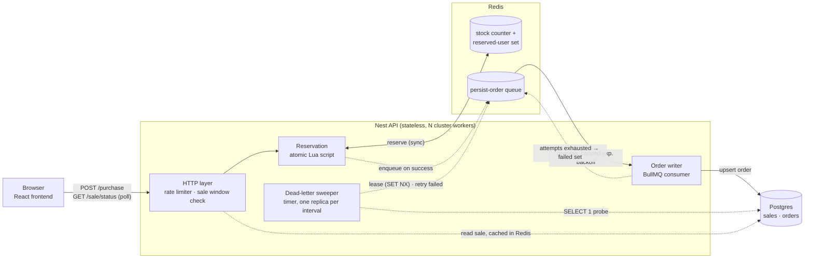
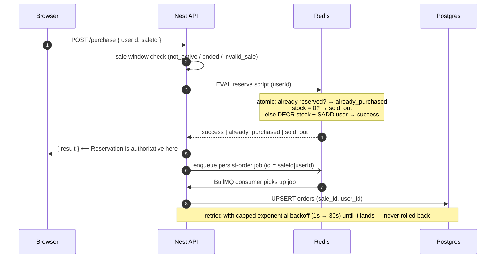

# Flash Sale

See [CONTEXT.md](./CONTEXT.md) for domain vocabulary and [docs/adr](./docs/adr) for architectural decisions.

## Layout

This is a Yarn workspaces monorepo:

- `/server` — Nest.js API (TypeScript), Prisma against Postgres.
- `/frontend` — React app (TypeScript), Vite.
- `docker-compose.yml` — Redis and Postgres only. The server and frontend are **not** dockerized; they run locally against this infra.

## Running the app

1. Install dependencies once, from the repo root:

   ```sh
   yarn
   ```

2. Build the shared `common` package and generate the Prisma client. Both are gitignored build outputs, so this is needed before `common` will resolve or the server will typecheck/run:

   ```sh
   yarn generate
   ```

3. Run the app. This starts the Docker infra (Postgres and Redis) and the API and frontend together:

   ```sh
   yarn dev
   ```

   Or run just one, from the repo root: `yarn workspace server run dev` / `yarn workspace frontend run dev`.

4. Apply database migrations (first time, and whenever the schema changes):

   ```sh
   yarn migrate:db
   ```

5. Copy env file:

   ```sh
   cp server/.env.example server/.env
   ```

## User flow

With the app running (`yarn dev`), a typical walkthrough:

1. Go to `/admin` and log in with the admin key (`change-me` by default, from `server/.env.example`'s `ADMIN_KEY`).
2. Fill up and create a sale using the admin sale form.
3. Go back to `/` (the "Sale" nav link) and enter a user name.
4. Attempt a purchase.

## Running tests

There are five kinds of server tests, from fastest/narrowest to slowest/broadest:

- **Unit** (`*.spec.ts`) — no external infra required.
- **Integration** (`*.integration.spec.ts`) — hit real Redis/Postgres/BullMQ directly (no HTTP layer). Requires `yarn dev`'s Docker infra running against your normal dev `DATABASE_URL`/`REDIS_URL`.
- **E2E** (`*.e2e-spec.ts`) — spin up the Nest app in-process and exercise it over HTTP with supertest.
- **Performance** (`*.performance-spec.ts`) — load-test the real app under `autocannon`/concurrent load, either against real Redis directly (`redis-reserve.performance-spec.ts`) or against a clustered server process (`purchase.performance-spec.ts`, `sale-status.performance-spec.ts`). Each HTTP suite runs under two load profiles: a short **spike** of many connections and a longer **stress** run with fewer connections.
- **Fault tolerance** (`*.fault-spec.ts`) — boot the real app and then break its infra out from under it via the Docker CLI: stopping Postgres mid-purchase (write retry), wiping Redis (stock reconciliation from Postgres), network-partitioning Redis (command timeouts), restarting the app with a BullMQ backlog still failing against a dead Postgres (exactly-once drain), a persist-order enqueue that fails after the Reservation landed (re-enqueued by startup reconciliation), a persist-order job that exhausts its attempts against a dead Postgres (dead-lettered with an alert, then replayed by reconciliation), and the same with two app replicas running (the sweep holds off while Postgres is down, then exactly one replica replays it). Each suite checks the app recovers with no lost or duplicated orders. Requires `docker` on your PATH; the suites run one file at a time since they take down the shared containers.

E2E, performance and fault-tolerance tests run against an isolated database/Redis logical DB (see `server/.env.e2e`) rather than your dev environment, so they never read or clobber dev data. That database only exists if you're on a fresh Postgres volume (created by `docker/postgres-init/01-create-e2e-db.sql`) or you migrate it yourself:

```sh
yarn workspace server run migrate:e2e-db
```

Then, from the repo root:

```sh
yarn test:unit         # unit tests

# Everything below needs the yarn dev's infra (DB and Redis) running
yarn test:integration  # integration tests
yarn test:e2e          # e2e tests (needs the e2e db migrated, see above)
yarn test:performance  # performance tests (same isolated db/redis as e2e)
yarn test:fault-tolerance  # fault-tolerance tests (same isolated db/redis; stops/partitions the Docker containers)
```

Performance tests default to a 4-worker clustered server and can be tuned via env vars under `.env.e2e.` see the `test/support/config.ts` file for more details.

## Design choices and trade-offs

Vocabulary (Sale, Stock, Reservation, Order, Reconciliation) is in [CONTEXT.md](./CONTEXT.md); the core decision is [ADR-0001](./docs/adr/0001-redis-reservation-postgres-order.md).

### System diagram

**Redis decides, Postgres remembers.** The Reservation (stock decrement + one-per-user check) is one atomic Lua script in Redis, answered synchronously. The durable Order row is written to Postgres afterwards by a BullMQ consumer and retried until it lands.





Steps 1–5 are the hot path and touch only Redis. Steps 6–8 are async and idempotent (job id `saleId|userId`, upsert on `UNIQUE (sale_id, user_id)`), so retries and re-enqueues are harmless.

### Key decisions

- **Redis decides who gets an item, Postgres keeps the record.** Doing this in Postgres alone would make every buyer wait in line on a single row, which caps how fast the sale can go. Redis answers in memory in one step, and Postgres only has to write one row per buyer afterwards, with no contention.

_Trade-off:_ for a few seconds Redis is the only place a purchase exists. If Redis restarts it loses at most one second of data because of every-second persisting, and on startup the app rebuilds Redis from Postgres if anything is missing.

_Trade-off:_ consistency over availability. If Redis is unreachable the sale stops (`/purchase` and `/sale/status` return 5xx) rather than guessing, so nobody is oversold or double-charged, whereas Postgres can be down for minutes and the sale keeps running.

- **A job queue writes the order to Postgres.** The queue lives in Redis, so there is nothing extra to run, and it retries with capped exponential backoff (1s doubling to 30s, ±20% jitter) until Postgres accepts the write. Each job is keyed by sale + user, so sending the same one twice does nothing.

_Trade-off:_ once the buyer is told "success", that decision is final. If the Postgres write fails, the job keeps retrying rather than reversing the purchase, so an order row can lag behind the confirmation by seconds or minutes while Postgres is unavailable.

- **Dead-letter after `PERSIST_ORDER_ATTEMPTS` (default 50 ≈ 23 min).** A job that still can't land stays in BullMQ's `failed` set and the consumer logs a `DEAD-LETTERED` error naming the sale and user. Nothing is lost: the Reservation is still held in Redis, and a periodic sweep (`DeadLetterSweeper`, default every 60s) replays the job once Postgres answers a `SELECT 1` probe. A Redis lease (`SET NX PX`) ensures only one replica sweeps at a time. Reconciliation replays them too: on startup it walks every sale that ended within `RECONCILE_SALES_WINDOW_MS` (default 7 days), not just the current one, so an older sale's stranded jobs are picked up even after a new sale has been created.

_Trade-off:_ giving up bounds how long a dead Postgres is hammered, and the alert keeps firing every cycle until someone fixes it. The cost is one small lease key in Redis; servers stay stateless.

- **The page polls instead of using WebSockets.** A status check is two cheap Redis reads and no server has to remember who is connected, so any server can answer any request.

_Trade-off:_ the countdown and stock number can be up to 4 seconds stale, which never changes who gets an item.

- **Servers hold no state.** Rate limits, stock, who has bought, and the queue all live in Redis, so scaling is just running more servers. The sale window (not started / live / ended) is checked before Redis is touched. Admin access is a shared secret and users are a plain id, as the assignment allows.

### Known limitations (by design, for the time budget)

- No cloud deployment.
- Single Redis instance: Sentinel/Cluster in production to shorten the outage window, reconciliation already covers "Redis came back empty".
- Single API process using Node `cluster` workers instead of a load balancer in front of independent API replicas. The servers are stateless, so swapping to replicas is a deployment change, not a code change.
- No real auth: admin is a shared secret, users are a plain id.
- No on-demand reconciliation endpoint in case of failure. Reconciliation runs only on startup (sales from the last `RECONCILE_SALES_WINDOW_MS`) and on sale creation (that sale).
- No chaos test for a worker crash mid-request — the cluster respawns workers, and the crash window between `EVAL` and enqueue is covered by the enqueue-failure test plus startup reconciliation.

## Expected performance

`yarn test:performance` runs [autocannon](https://github.com/mcollina/autocannon) against a real clustered server with real Redis and Postgres (spike: 1000 connections × 15s; stress: 100 × 60s; tune via `SPIKE_*` / `STRESS_*` / `CLUSTER_WORKERS` in `server/test/support/config.ts`), then checks the invariants directly in the stores: an understocked sale ends with stock exactly 0 and exactly that many Orders, an overstocked sale has Orders == stock decremented == distinct users, and a same-user run yields exactly 1 Order — with zero errors, timeouts or non-2xx responses.

On a 20-core WSL2 host with 4 workers this sustains ~27–36k `POST /purchase` req/s (p99 < 60 ms) on the sold-out / duplicate fast path, ~6–13k req/s when every request succeeds and is persisted through BullMQ, and ~48k req/s on `GET /sale/status`; the reserve script alone does ~75k ops/s, so the next bottleneck is API replicas, not Redis. Absolute numbers vary by hardware; the invariants are what the suite asserts.
