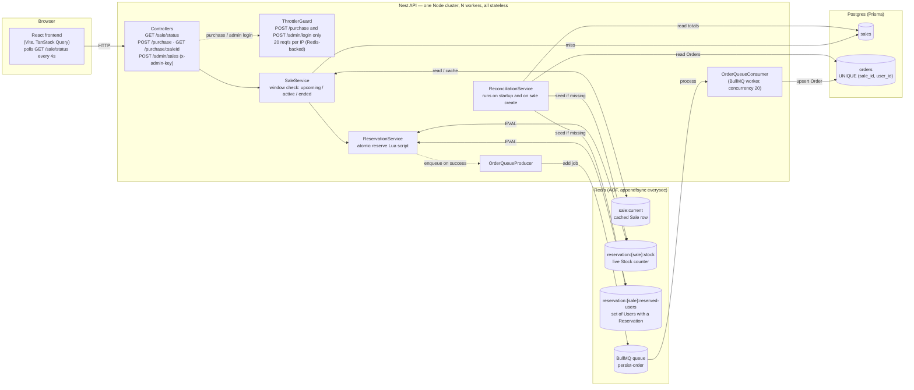
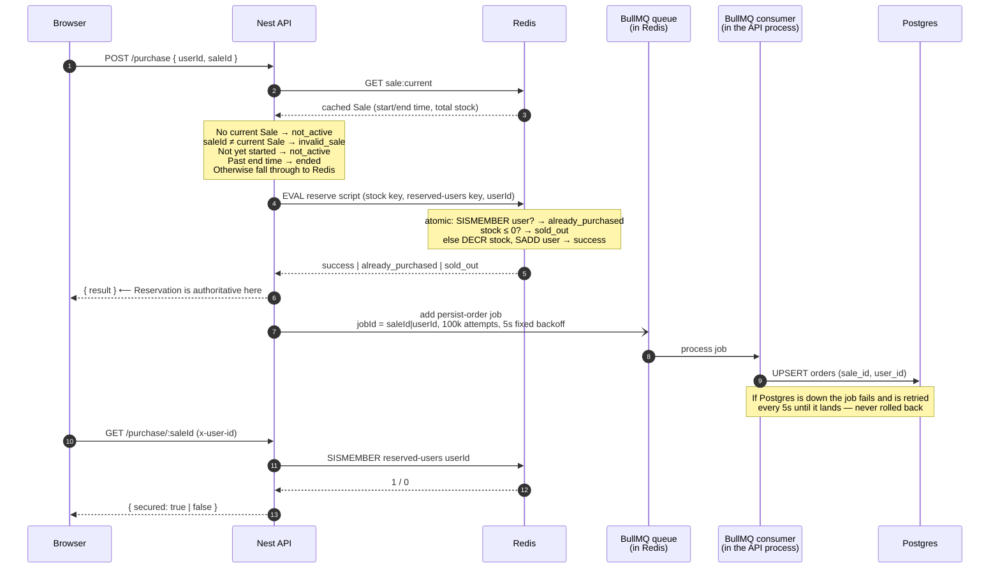

# Flash Sale

See [CONTEXT.md](./CONTEXT.md) for domain vocabulary and [docs/adr](./docs/adr) for architectural decisions.

## Layout

This is a Yarn workspaces monorepo:

- `/server` — Nest.js API (TypeScript), Prisma against Postgres.
- `/frontend` — React app (TypeScript), Vite.
- `docker-compose.yml` — Redis and Postgres only. The server and frontend are **not** dockerized; they run locally against this infra.

## Running the app

1. Install dependencies once, from the repo root:

   ```sh
   yarn
   ```

2. Build the shared `common` package and generate the Prisma client. Both are gitignored build outputs, so this is needed before `common` will resolve or the server will typecheck/run:

   ```sh
   yarn generate
   ```

3. Run the app. This starts the Docker infra (Postgres and Redis) and the API and frontend together:

   ```sh
   yarn dev
   ```

   Or run just one, from the repo root: `yarn workspace server run dev` / `yarn workspace frontend run dev`.

4. Apply database migrations (first time, and whenever the schema changes):

   ```sh
   yarn migrate:db
   ```

5. Copy env file:

   ```sh
   cp server/.env.example server/.env
   ```

## User flow

With the app running (`yarn dev`), a typical walkthrough:

1. Go to `/admin` and log in with the admin key (`change-me` by default, from `server/.env.example`'s `ADMIN_KEY`).
2. Fill up and create a sale using the admin sale form.
3. Go back to `/` (the "Sale" nav link) and enter a user name.
4. Attempt a purchase.

## Running tests

There are five kinds of server tests, from fastest/narrowest to slowest/broadest:

- **Unit** (`*.spec.ts`) — no external infra required.
- **Integration** (`*.integration.spec.ts`) — hit real Redis/Postgres/BullMQ directly (no HTTP layer). Requires `yarn dev`'s Docker infra running against your normal dev `DATABASE_URL`/`REDIS_URL`.
- **E2E** (`*.e2e-spec.ts`) — spin up the Nest app in-process and exercise it over HTTP with supertest.
- **Performance** (`*.performance-spec.ts`) — load-test the real app under `autocannon`/concurrent load, either against real Redis directly (`redis-reserve.performance-spec.ts`) or against a clustered server process (`purchase.performance-spec.ts`, `sale-status.performance-spec.ts`). Each HTTP suite runs under two load profiles: a short **spike** of many connections and a longer **stress** run with fewer connections.
- **Fault tolerance** (`*.fault-spec.ts`) — boot the real app and then break its infra out from under it via the Docker CLI: stopping Postgres mid-purchase (write retry), wiping Redis (stock reconciliation from Postgres), network-partitioning Redis (command timeouts), restarting the app with a BullMQ backlog still failing against a dead Postgres (exactly-once drain), and a persist-order enqueue that fails after the Reservation landed (re-enqueued by startup reconciliation). Each suite checks the app recovers with no lost or duplicated orders. Requires `docker` on your PATH; the suites run one file at a time since they take down the shared containers.

E2E, performance and fault-tolerance tests run against an isolated database/Redis logical DB (see `server/.env.e2e`) rather than your dev environment, so they never read or clobber dev data. That database only exists if you're on a fresh Postgres volume (created by `docker/postgres-init/01-create-e2e-db.sql`) or you migrate it yourself:

```sh
yarn workspace server run migrate:e2e-db
```

Then, from the repo root:

```sh
yarn test:unit         # unit tests

# Everything below needs the yarn dev's infra (DB and Redis) running
yarn test:integration  # integration tests
yarn test:e2e          # e2e tests (needs the e2e db migrated, see above)
yarn test:performance  # performance tests (same isolated db/redis as e2e)
yarn test:fault-tolerance  # fault-tolerance tests (same isolated db/redis; stops/partitions the Docker containers)
```

Performance tests default to a 4-worker clustered server and can be tuned via env vars under `.env.e2e.` see the `test/support/config.ts` file for more details.

## Design choices and trade-offs

The vocabulary below (Sale, Stock, User, Reservation, Order, Reconciliation) is defined in [CONTEXT.md](./CONTEXT.md); the core decision is recorded in [ADR-0001](./docs/adr/0001-redis-reservation-postgres-order.md).

### System diagram

Two stores with clearly separated jobs: **Redis** decides, **Postgres** remembers. The Reservation (stock decrement + one-per-user check) is a single atomic Lua script in Redis, answered synchronously on the request path. The durable Order row is written to Postgres afterwards by a BullMQ consumer, off the hot path, and retried until it lands.



Everything inside the API box is stateless: the whole cluster (and any number of extra replicas) shares one Redis and one Postgres, so the rate limiter, the stock counter, the reserved-user set and the job queue are all consistent across workers.

### How a purchase flows through the system

Reserve-then-confirm, per ADR-0001: the Reservation is authoritative the instant Redis answers, and the Order write is guaranteed-eventually.



Only steps 1–6 are on the user-facing hot path, and they touch nothing but Redis. Steps 7–9 are asynchronous and idempotent: the job id is `saleId|userId`, so a re-enqueue of the same Reservation is de-duplicated by BullMQ, and the Postgres write is an `upsert` against the `(sale_id, user_id)` unique constraint, so a job retried after a crash between the write and the ack lands cleanly.

### Redis owns the Reservation, Postgres owns the Order

The full reasoning is in ADR-0001; the short version:

- **Postgres only** (`UPDATE ... WHERE count > 0 RETURNING` + a unique constraint) is fully ACID but every concurrent purchase serialises on one row and pays a WAL fsync per commit. That row is the throughput ceiling of the whole system.
- **A queue in front of a single Postgres writer** removes lock contention but not the per-message fsync, and can't be scaled with more consumers without reintroducing the row contention. Making that consumer fast means giving it an in-memory counter, i.e. a bespoke, non-durable, single-point-of-failure Redis.
- **Redis Reservation + async Postgres Order** (chosen): Redis executes a Lua script atomically and single-threaded per key, so the contended decision is one in-memory round trip. Postgres inserts are per-user and uncontended, so persisting Orders scales trivially with more consumers.

What this costs: an eventual-consistency window between a successful Reservation and its durable Order row, and Redis briefly being the only place the truth lives. Both are mitigated deliberately:

- The "did I secure an item?" read (`GET /purchase/:saleId`) is served from Redis, the instantly-consistent state, never from Postgres.
- Redis runs with AOF persistence (`appendfsync everysec`), so a Redis restart loses at most one second of Reservations, not the whole sale.
- **Reconciliation** rebuilds Redis from Postgres: `stock = Sale.total_stock − count(Orders)`, `reserved_users = {u : Order(u) exists}`. It runs on app startup and when a Sale is created, and it is safe to run any number of times because it only ever fills a *missing* key (`SET ... NX`, and a set-seeding script that skips an existing set). It must never overwrite a live key: Postgres's Order count can lag Redis's already-correct counter by a few seconds, so overwriting would resurrect units that have already been sold.
- Reconciliation also runs the other way: any reserved User with no Order gets their persist-order job re-enqueued, so a Reservation whose enqueue failed still lands.

### Why BullMQ for the Order write

The job queue needs to be durable, retrying, and idempotent, and it needs to be reachable by every API replica. BullMQ is Redis-backed, so it adds no new infrastructure, and it gives us the retry policy declaratively: `attempts: 100_000` with a fixed 5s backoff, `removeOnComplete`, and a caller-supplied `jobId` (`saleId|userId`) that makes enqueueing the same Reservation twice a no-op. The consumer runs inside every API process (concurrency 20), so consumers scale with the API and there is no separate worker deployment to run.

An Order write is never rolled back on failure: a failed job is simply retried until Postgres is back. The Reservation the user was told about is the source of truth, and the Order is the durable trail of it. The fault-tolerance suite covers Postgres going down mid-sale, a BullMQ backlog surviving an API restart, and an enqueue that fails after the Reservation landed.

### Why polling, not WebSockets

The frontend polls `GET /sale/status` every 4 seconds (TanStack Query `refetchInterval`) and fetches `GET /purchase/:saleId` whenever a user id and current Sale are known (the purchase response updates it directly). A flash sale's hard problem is the write burst at the start time, not the read side, and polling keeps the read side cheap and stateless:

- The current Sale row is cached in Redis (`sale:current`), so a status read is one Redis `GET` plus one `GET` on the stock counter — Postgres is never on the read path. The `sale-status.performance-spec.ts` suite exercises exactly this.
- No persistent connections means any worker or replica can answer any request, and a rolling restart or a crashed worker drops nothing that matters.
- The user's decisive moment (`POST /purchase`) already gets its answer synchronously; a 4s-stale countdown and stock indicator is an acceptable trade for that simplicity.

WebSockets would need a pub/sub fan-out across replicas and per-connection state on each worker, for a smoother countdown that doesn't change any outcome.

### Smaller design choices

- **Sale time window is enforced before Redis is consulted.** `SaleService` classifies the request as `before` / `within` / `after` the window from the cached Sale row, so an `Upcoming` or `Ended` sale never even reaches the reservation script. `SoldOut` and `Ended` are independent terminal states, as in CONTEXT.md.
- **Rate limiting** uses the official `@nestjs/throttler` on `POST /purchase` and `POST /admin/login` (20 req/s per IP, tunable via `THROTTLE_LIMIT`) with a Redis-backed store, so the limit holds across cluster workers and replicas rather than being per-process. It is switched off (`DISABLE_THROTTLE=true`) for the load tests, where all traffic comes from one IP.
- **Node cluster.** The server forks `CLUSTER_WORKERS` (default 4, capped at the machine's cores) workers sharing one port; a worker that dies is replaced. This is the single-host version of the "many stateless replicas" story.
- **Bounded Redis command timeout** (`REDIS_COMMAND_TIMEOUT_MS`, default 3000ms). Without it, ioredis's offline queue holds commands open indefinitely during a network partition, so a purchase would hang instead of failing fast with a 5xx. This surfaced from the Redis-partition fault test.
- **Admin auth** is a shared secret in an `x-admin-key` header checked against `ADMIN_KEY` — proportionate for a take-home, not real auth. Users are a bare caller-supplied identifier, per the assignment's own simplification.
- **Shared request/response schemas.** `common/` holds the Zod schemas and response types used by both the Nest validation pipe and the React forms, so the two sides can't drift.
- **Sale history is append-only.** Creating a Sale appends a row; the most recently created Sale is current, and older rows are kept only as history.

### Scaling out and known limitations

**How this scales.** The API is stateless, so horizontal scaling is "run more replicas behind a load balancer" — the Node cluster is the same idea on one host. Every replica shares the Redis-backed throttler, stock counter, reserved-user set and job queue, so correctness doesn't depend on which replica a request lands on. The hot path is bounded by Redis's single-key throughput for the reserve script (measured by `redis-reserve.performance-spec.ts`, see below), which is orders of magnitude above the Postgres-row-lock alternative. Postgres only sees uncontended per-user upserts, spread over as many consumers as there are API processes.

**What is deliberately not built** (documented as design intent only, per the time budget):

- **Live cloud deployment / real multi-host scaling.** The assignment doesn't require it; the narrative above is how it would go.
- **Chaos tests for an API worker crashing mid-request, and a literal Postgres network partition.** The cluster primary respawns dead workers, and a crash between the Redis `EVAL` and the enqueue is covered by the enqueue-failure fault test plus startup reconciliation. The Postgres side is substantively covered by the Postgres-stop retry test; a partition looks the same to the consumer (a failing write that is retried).
- **Real authentication.** Users are an identifier string and the admin key is a shared secret.
- **An admin "re-run reconciliation" endpoint.** Reconciliation runs on startup and on sale creation, which covers the recovery scenarios tested; an on-demand trigger would be a small addition.
- **Redis high availability.** A single Redis with AOF is the durability story here. In production this would be Redis Sentinel/Cluster or a managed equivalent; the reconciliation path already handles the "Redis came back empty" case.

## Expected performance

The stress tests (`yarn test:performance`; infra alone can be started with `docker compose up -d --wait` if `yarn dev` isn't running) use [autocannon](https://github.com/mcollina/autocannon) to hammer a real clustered server process — `server/src/main.ts` forked with `CLUSTER_WORKERS` workers against real Redis and Postgres — and then check the invariants directly in Redis and Postgres afterwards.

Load shape env vars (defaults in `server/test/support/config.ts`, except `UNDERSTOCKED_STOCK` which lives in `purchase.performance-spec.ts`):

| Variable | Default | Meaning |
|---|---|---|
| `SPIKE_CONNECTIONS` / `SPIKE_DURATION` | `1000` / `15` | **Spike** profile: many concurrent connections for a short burst |
| `STRESS_CONNECTIONS` / `STRESS_DURATION` | `100` / `60` | **Stress** profile: fewer connections sustained for longer |
| `UNDERSTOCKED_STOCK` | `50` | Stock for the oversell scenario (must be far below the number of requests) |
| `CLUSTER_WORKERS` | `4` | Server workers under test (capped at available cores) |
| `AUTOCANNON_WORKERS` | `5` | autocannon worker threads; connection counts must divide evenly by this |

For example, a heavier spike: `SPIKE_CONNECTIONS=2000 SPIKE_DURATION=30 yarn test:performance`.

### What it verifies

Every HTTP scenario runs under both load profiles. The harness first asserts that autocannon saw **zero errors, zero timeouts and zero non-2xx responses** and that every request was answered — i.e. the system stayed up and responsive — and then each scenario checks its invariant:

| Suite | Scenario | Expected outcome |
|---|---|---|
| `purchase.performance-spec.ts` | **Oversell**: unique user per request against a sale with only `UNDERSTOCKED_STOCK` (50) units, thousands of requests | The Redis Stock counter is exactly `0`, and once BullMQ drains Postgres has exactly 50 Orders from exactly 50 distinct Users. Never one more. |
| | **Overstocked**: unique user per request against 10,000,000 units | Every request succeeds exactly once: Orders in Postgres == Stock decremented in Redis == distinct Users. Proves nothing is lost or double-counted on the async path. |
| | **Duplicate user**: every request is the *same* user, stock ≥ connections | Exactly 1 Order — the one-per-user half of the invariant, isolated from the stock half. |
| `sale-status.performance-spec.ts` | Every connection polls `GET /sale/status` | All answered, and the cached Sale in Redis is intact afterwards. |
| `redis-reserve.performance-spec.ts` | `SPIKE_CONNECTIONS` concurrent `EVAL`s of the reserve script straight against Redis (no HTTP/Nest/Postgres) | All succeed, stock decremented by exactly that many; prints the raw ops/sec ceiling of the reservation script itself. |

The per-IP rate limiter is disabled for the server under test (`DISABLE_THROTTLE=true`) because all the load comes from one process/IP and the suite targets the reservation logic, not the throttler.

### Observed results

One full run of `yarn test:performance` at the defaults (`CLUSTER_WORKERS=4`, `AUTOCANNON_WORKERS=5`) on a 20-core WSL2 machine with the docker-compose Redis/Postgres on the same host. All 9 tests passed; every scenario's invariant held (exactly 50 / exactly 1 / Orders == Stock decremented) with zero errors, timeouts or non-2xx responses.

| Scenario | Profile | Requests | Req/s (median) | Latency p50 / p99 |
|---|---|---|---|---|
| `POST /purchase` oversell (stock 50, unique users) | spike, 1000 conns × 15s | 462k | 34,175 | 28 ms / 57 ms |
| | stress, 100 conns × 60s | 1,572k | 26,735 | 3 ms / 7 ms |
| `POST /purchase` overstocked (10M stock, unique users) | spike, 1000 conns × 15s | 200k | 13,191 | 74 ms / 110 ms |
| | stress, 100 conns × 60s | 350k | 5,887 | 16 ms / 30 ms |
| `POST /purchase` duplicate (same user every request) | spike, 1000 conns × 15s | 535k | 36,575 | 27 ms / 43 ms |
| | stress, 100 conns × 60s | 1,612k | 26,943 | 3 ms / 7 ms |
| `GET /sale/status` | spike, 1000 conns × 15s | 685k | 48,095 | 20 ms / 35 ms |
| | stress, 100 conns × 60s | 2,219k | 37,023 | 2 ms / 5 ms |
| Reserve script alone (1000 concurrent `EVAL`s, no HTTP) | — | 1,000 | 75,357 ops/s | 13 ms total |

Reading the numbers:

- **Oversell and duplicate runs are the fast path.** After the first 50 (or 1) successes every remaining request is answered `sold_out` / `already_purchased` straight out of the Lua script with nothing enqueued, so these show the API + Redis round-trip cost: ~27–35k req/s at single-digit millisecond p99 under sustained load.
- **The overstocked run is the slow path on purpose.** Every request is a `success`, so every request also enqueues a BullMQ job and the consumers are upserting hundreds of thousands of Order rows into Postgres while the load is still running. Throughput drops to ~6–13k req/s and the invariant (Orders == Stock decremented == distinct Users) still holds once the queue drains — the async path loses nothing under sustained pressure.
- **Status polling is cheaper than purchasing** (two Redis `GET`s, no script), which is what makes the polling-over-WebSockets choice comfortable.
- **The reserve script itself is not the bottleneck.** At ~75k ops/s against a single local Redis it has 2–3× headroom over what the 4-worker API pushes through it, so the next scaling step is more API replicas, not a faster store.
- Spike-profile max latencies (1–2.5s) are the initial connection burst of 1000 sockets opening at once; p99 stays well under 120 ms in every run.

Absolute numbers will vary with hardware; the invariants (exact success counts, zero oversell, zero duplicates, zero unanswered requests) are what the suite asserts and are expected to hold on any machine.
